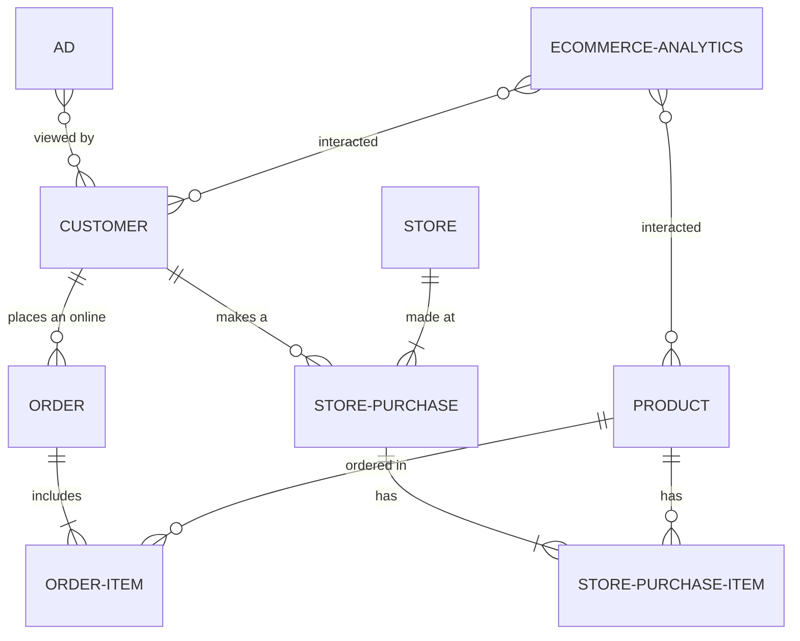

# Data Cloud Generator

A CLI utility to generate data that is then pushed to S3 and can be consumed by Salesforce Data Cloud. 

## Installation

`npm i -g @mvogelgesang/datacloudgenerator`

Create dcGenerator_config.js

```js
module.exports = {
    awsBucketName: "your-bucket-name",
    awsProfileName: "your-profile-name",
    awsRegion: "your-region",
  };
```

## Data Model



## Use

`dcGen` is the global namespace followed by the data type and the number of records you want to generate. If the number of records is blank, it defaults to 10.

Generate online advertising data
`dcGen ad 100`

Generate customer data
`dcGen customer 100`

Generate ecommerce analytics data
`dcGen ecommerce 100`

Generate Order and Order Item data
`dcGen order 5`

Generate Product data
`dcGen product 100`

Generate Store Purchase data
`dcGen store-purchase 3`
